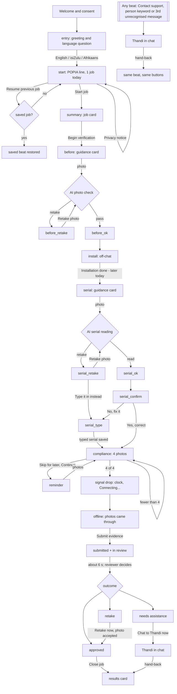

# Home FIX: conversation design specification

Prototype: `dist/Home_FIX_Mobile.html`. This document describes the prototype as it stands after fixes F01–F20 and testing-readiness items T01–T06. It does not describe features the prototype does not have.

String ids in this document (for example `m_greeting`) refer to the `COPY` table in `src/template.html` and to `docs/copy-deck.csv`. The isiZulu and Afrikaans strings are drafts that need native review.

## 1. Summary

**Problem.** Insurance-panel plumbers replace burst electric geysers. Home FIX needs proof that each replacement was done properly before it approves the job and pays. Today that proof is uneven: photos are blurry, the serial number label is unreadable, compliance items are missing, and installers do not know what "good" looks like.

**Users.** The installer (a plumber, here "Sipho") sends the evidence. A Home FIX reviewer decides. A support agent ("Thandi") helps when the installer is stuck or when the reviewer cannot approve from the photos.

**Channel.** A WhatsApp Business conversation. The prototype imitates a generic chat app; it is not WhatsApp.

**Languages.** English, isiZulu and Afrikaans. The installer chooses in the first message and can switch at any time.

**What the AI does.** Two automated checks: a photo quality check (is the photo clear enough, does it show what was asked) and a serial number reading (OCR). The AI can accept a photo or ask for another one. It never rejects a job, never blocks the installer, and never approves payment.

**What people do.** The installer confirms or corrects what the AI read. A reviewer makes every approval decision. An agent takes over in the chat when asked, or when the reviewer cannot approve.

**Evidence collected (6 items).** 1 before photo, 1 serial number label photo, 4 compliance photos: pressure control valve (PCV), installation overview, drip tray and overflow, electrical isolator. Plus the serial number value, confirmed or typed by the installer.

## 2. Users and context

| Person | Role in the conversation | What they need |
|---|---|---|
| Installer (Sipho) | Sends photos, confirms the serial number, submits | Short steps, clear photo guidance, a way out when stuck, to know when they will be paid |
| Reviewer (Home FIX specialist) | Sees the evidence and the AI results; approves, asks for a retake or refers to an agent | Clear photos, the serial value with its source (read or typed), reason codes for anything unusual |
| Support agent (Thandi) | Replies in the same chat; finishes jobs the reviewer could not approve | The job reference, where the installer is in the flow, what has been sent |
| Customer (M. Khumalo) | Not in the conversation | A safe, compliant installation |

**Site conditions in South Africa that shape the design**

- **Roof spaces and geyser cupboards.** Cramped, hot and dark. Installers often hold a torch or a ladder with one hand. Guidance says "Use your phone torch if it's dark" and gives a distance (15–20 cm) rather than abstract advice.
- **Low light and glare.** Serial labels are often metallic or behind a plastic sleeve. Glare is the most likely failure, so the serial step has its own retake guidance and a "Type it in instead" way out.
- **Poor signal.** Roof spaces and townhouse complexes often drop signal. The flow tolerates a dropped upload without scaring the installer (F08).
- **Load-shedding.** Routers and towers can go down. Progress is saved after every step; the installer can come back.
- **Data cost.** Prepaid data is expensive. The flow asks for each photo once, explains failures in text, and avoids sending images back to the installer apart from one optional example.
- **Two sittings.** The before photo is taken on arrival. The serial label belongs to the new geyser, so it can only be photographed hours later, after installation (F04).

**Trade vocabulary** kept in English in every language because installers use it: geyser (isiZulu loan word i-geyser), PCV, drip tray, overflow, isolator, serial. Afrikaans uses the common trade words geiser, drukbeheerklep, drupbak, oorloop, isolator, reeksnommer.

## 3. Assistant persona and voice

**Name.** The assistant has no personal name. It speaks as "Home FIX verification" (`m_greeting`), and its AI checks appear under "Home FIX AI · automated check". People in the conversation have names (Thandi). This keeps the line between the automated assistant and a person clear.

**Disclosure.** The AI card header always says "automated check". The in-review card says "A real person makes the final decision, not an automated system." The support agent introduces herself by name in a bold first line.

**Tone.** Plain, respectful and practical. Short sentences. It explains what to do, not how the system works. It treats failures as normal ("No problem — this happens often.").

| Do | Don't |
|---|---|
| Name the next action: "Tap Installation done." | Say "Please proceed to the next step." |
| Give a concrete fix: "Stand 15–20 cm back and use your torch." | Say "Image quality insufficient." |
| Use the installer's name at the start and at outcomes | Use the name in every message |
| Say who decides and when: "A real person makes the final decision." | Imply the AI approves or rejects |
| Keep trade terms installers use (geyser, PCV, isolator) | Translate trade terms into words nobody uses on site |
| Admit limits: "Sorry, I didn't catch that." | Pretend to understand free text |

**Formatting rules**

- One idea per message; no message longer than three short sentences.
- Cards carry structured information (fields, checklists, guidance). Text bubbles carry conversation.
- 24-hour times (13:18). Dates as "18 Jun 2026" (isiZulu "18 Juni 2026", Afrikaans "18 Jun. 2026").
- UK spelling. "Geyser" and "torch", not "water heater" and "flashlight".
- Quoted keywords use curly quotes: type “person”.

**Emoji policy.** Only ✅ at the start of an accepted AI result. No other emoji. The original 🔒 banner was removed (F17).

## 4. Language system

**Selection.** The welcome screen has a language switcher, and `#lang=xx` in the link preselects it. The first chat messages (greeting and language question) appear in that language. The first message then offers three reply buttons: English, isiZulu, Afrikaans, each with a subtitle in its own language (`lang_*`, `lang_*_sub`). Everything from "Start job" onwards appears in the chosen language (F02).

**Typed choice.** At the language question, typing "English", "isiZulu", "Zulu" or "Afrikaans" (any case, accents ignored) also chooses.

**Switching.** Typing a language keyword at any point shows the language buttons again. Choosing one switches immediately, confirms in the new language (`m_lang_changed`) and re-sends the current step's quick replies in the new language. Progress is kept. Earlier messages stay in the language they were sent in, as in a real chat.

**Keywords.** Recognised in every language at every point. Matching ignores case, accents and punctuation, and the whole message must be the keyword.

| Intent | English | isiZulu | Afrikaans | Response |
|---|---|---|---|---|
| Help | help | usizo | hulp | One line describing the current step, plus the person and language keywords (`m_help` + `step_*`) |
| Person | person | umuntu | persoon | In-chat handover to Thandi (section 11) |
| Language | language | ulimi | taal | Language buttons (`m_lang_q`) |

**Never fall back to English.** Every string id has en, zu and af. `tools/check.js` fails the build if any is missing, and `t()` logs an error and shows `[id]` rather than English if a string is ever missing at runtime.

**Not translated.** Home FIX, Home FIX AI, the job reference (HF-2026-DBN-04821), the serial number, POPIA, names (Sipho, Thandi, M. Khumalo), places (Durban, KZN), file names on sample photos, and the AI badge "AI".

**Numbers and dates.** 24-hour time in all languages. Dates: "18 Jun 2026" (en), "18 Juni 2026" (zu), "18 Jun. 2026" (af). Ranges use an en dash: 15–20 cm, 07:00–19:00.

**Character limits.** Reply button labels: 20 characters in every language (WhatsApp limit). The build check enforces this for every `btn_*` string and for every label a beat shows; the tests also check every quick-reply state reached in 12 full runs. Translations were shortened to fit (for example Afrikaans "Gesels met Thandi" for "Chat to Thandi now"). Labels are never visually truncated.

**Native review.** All isiZulu and Afrikaans strings except the six language names are marked `needs_native_review = yes` in `docs/copy-deck.csv`. Process: a first-language speaker who knows the trade reviews the CSV, edits the `zu`/`af` columns, and the strings are copied back into `COPY`. Re-run `tools/pack.py`; the build check confirms nothing is missing and every label still fits.

## 5. Flow map

## 6. Beat inventory

A beat is one turn of the assistant: the messages it sends and the quick replies it then shows. Progress is the evidence count shown in the strip under the header (0–6). Times are the simulated clock.

| Beat id | Purpose | Bot messages (string ids) | Card | Quick replies → destination | Typed input accepted | Progress | Time |
|---|---|---|---|---|---|---|---|
| `entry` | Greet, ask for language | `chip_today`, `m_greeting`, `m_lang_q` | — | `lang_en`, `lang_zu`, `lang_af` → `start` | Language names; keywords | 0 | 09:30 |
| `start` | Confirm language, privacy notice, job count | `m_hi`, `m_popia`, `m_jobs` | — | `btn_start` → `summary`; `btn_resume` → resume (F05); `btn_privacy` → `m_privacy_tap` | Keywords | 0 | 09:31 |
| `summary` | Show the job | summary card (`card_summary_title`, `f_reference`, `f_customer`, `f_region`, `f_installation`, `v_installation`, `sum_progress_note`), `m_ready` | Summary | `btn_begin` → `before` | Keywords | 0 | 09:32 |
| `before` | Ask for the before photo | `m_before_intro`, guidance card (`g_before_title`, `g_before_sub`, `h_what`, `i_whole`, `i_area`, `h_tips`, `i_light`, `i_back`, `i_lens`, `ph_good_example`, `ph_too_close`, `badge_good`, `badge_avoid`, `g_before_footer`) | Guidance | `btn_upload_photo` → camera → photo check → `before_retake` or `before_ok`; `btn_need_help` → `m_need_help` | Photo; keywords | 0 | 09:33 |
| `before_retake` | Photo too blurry | AI card (`ai_photo_check`, `ui_ai_auto`, `ai_blurry`, `ai_blurry_note`) | AI | `btn_retake` → camera → photo check; `btn_support` → handover | Photo; keywords | 0 | 09:34 |
| `before_ok` | Photo accepted | AI card (`ai_photo_check`, `ai_before_ok`, `ai_reviewer_later`), `m_one_of_six` | AI | none; continues to `install` | — | 1 | 09:35 |
| `install` | Installation happens off-chat (F04) | `m_install` | — | `btn_install_done` → `serial` | Keywords | 1 | 09:35 |
| `serial` | Ask for the serial label, hours later | `chip_later` (before the reply bubble), `m_serial_intro`, guidance card (`g_serial_title`, `badge_important`, `g_serial_sub`, `h_what`, `i_only_label`, `h_close`, `i_15_20`, `i_fill`, `h_lighting`, `i_torch`, `ph_serial_label`, `ph_glare`, `g_serial_footer`) | Guidance | `btn_upload_serial` → camera → serial reading → `serial_retake` or `serial_ok`; `btn_view_example` → example photo (`ph_example_serial`, `m_example_caption`) | Photo; keywords | 1 | 13:10 |
| `serial_retake` | Label unreadable (glare) | AI card (`ai_reading`, `ai_glare`, `r_glare`, `r_hidden`, `ai_glare_note`) | AI | `btn_retake` → camera; `btn_type_in` → `serial_type` (F14) | Photo; keywords | 1 | 13:11 |
| `serial_ok` | Serial read | AI card (`ai_reading`, `ai_serial_ok`, `ai_field_serial` = KWH-8842-ZA-117, `ai_reviewer_too`) | AI | none; continues to `serial_confirm` | — | 2 | 13:12 |
| `serial_confirm` | Installer confirms the reading (F13) | `m_serial_check` | — | `btn_yes_correct` → `compliance`; `btn_no_fix` → `serial_type` | Keywords | 2 | 13:12 |
| `serial_type` | Installer types the serial | `m_serial_type`; after the reply `m_serial_saved` | — | none | Any text (not a keyword) → saved trimmed, spaces collapsed, upper case → `compliance` | 1 if never read, else 2 | 13:13 |
| `compliance` | Ask for the 4 compliance photos (F06) | `m_compliance_intro`, checklist card (`c_title`, `c_pcv`, `c_pcv_sub`, `c_overview`, `c_overview_sub`, `c_drip`, `c_drip_sub`, `c_isolator`, `c_isolator_sub`, `c_note`) | Checklist | `btn_upload_photos` → gallery (multiple) → fewer than 4: `m_partial`, stay; 4 in total: signal drop → `offline`. `btn_skip` → `m_skip` + `btn_continue` → `reminder` | Photos; keywords | 2 | 13:14 |
| `reminder` | Ask again after a skip (F07) | `m_reminder` | — | `btn_upload_photos` (only) | Photos; keywords | 2 | 13:15 |
| `offline` | Photos arrived after the signal came back (F08) | status card (`s_came_through`, `s_came_body`, `f_completed` = `v_6of6_items`, `f_photos_received` = `v_4of4`, `s_came_note`) | Status (wait) | `btn_submit` → `submitted` | Keywords | 6 | 13:16 |
| `submitted` | Submitted, then in review (F09) | status card (`s_ok`, `s_ok_body`, `f_reference`, `f_submitted` = `v_date_submit`, `f_items` = `v_6complete`, `s_ok_note`), `m_thanks_team`, status card (`s_review`, `s_review_body`, `f_est` = `v_2h`, `f_reviewed_by` = `v_specialist`, `s_review_note`) | Status (good), status (wait) | `btn_support` → handover. The review outcome follows about 6 s later | Keywords | 6 | 13:18 |
| `approved` | Outcome: approved | `m_good_news`, status card (`s_approved`, `s_approved_body`, `f_reference`, `f_completed` = `v_date_approved`, `f_items` = `v_6verified`, `s_approved_note`) | Status (good) | `btn_close_job` → session ends, results card | Keywords | 6 | 14:52 |
| `retake` | Outcome: one item needs a retake | `m_almost`, status card (`s_retake`, `s_retake_body`, `f_item` = `g_serial_title`, `f_reason` = `v_glare_reason`, `s_retake_guide`) | Status (warn) | `btn_retake_now` → camera → AI card (`ai_photo_check`, `ai_retake_ok`), `m_sent_reviewer` → `approved` after about 4 s (F18); `btn_later` → `m_later_one`; `btn_support` → handover | Photo; keywords | 5 | 14:40 (retake reply 14:44) |
| `rejected` | Outcome: needs assistance (F16) | `m_patience`, status card (`s_agent_finish`, `s_agent_body`, `f_reason` = `v_mismatch`, `f_who` = `v_thandi`, `f_when` = `v_before15`, `s_agent_note`) | Status (bad) | `btn_chat_thandi` → handover; after the hand-back the session ends | Keywords | 6 | 14:35 |

Global replies available at any beat through typing: help, person and language keywords (section 4), and repair (section 10).

## 7. Message inventory

Generated from the `COPY` table by `tools/check.js`; identical to `docs/copy-deck.csv`. Character counts are Unicode code points. Limit is the WhatsApp limit for the element (20 for reply buttons) or a working limit for card parts.

| id | beat | element | en | zu | af | en_chars | zu_chars | af_chars | limit | needs_native_review |
|---|---|---|---|---|---|---|---|---|---|---|
| ui_online | all | status | online | uxhumekile | aanlyn | 6 | 10 | 6 | 1024 | yes |
| ui_typing | all | status | typing… | uyabhala… | tik tans… | 7 | 9 | 9 | 1024 | yes |
| ui_connecting | all | status | Connecting… | Iyaxhuma… | Koppel tans… | 11 | 9 | 12 | 1024 | yes |
| ui_message | all | input | Message | Umlayezo | Boodskap | 7 | 8 | 8 | 1024 | yes |
| ui_send | all | input | Send | Thumela | Stuur | 4 | 7 | 5 | 1024 | yes |
| ui_evidence | all | progress | Evidence | Ubufakazi | Bewyse | 8 | 9 | 6 | 1024 | yes |
| ui_ai_auto | all | ai-card | automated check | ukuhlola okuzenzakalelayo | outomatiese kontrole | 15 | 25 | 20 | 1024 | yes |
| ui_sample | all | link | Use a sample photo instead | Sebenzisa isithombe sesibonelo | Gebruik eerder 'n voorbeeldfoto | 26 | 30 | 31 | 1024 | yes |
| ui_photo_alt | all | photo | Your photo | Isithombe sakho | Jou foto | 10 | 15 | 8 | 1024 | yes |
| ui_photo | all | photo | photo | isithombe | foto | 5 | 9 | 4 | 1024 | yes |
| ui_photos_n | all | photo | {n} photos | izithombe ezingu-{n} | {n} foto's | 10 | 20 | 10 | 1024 | yes |
| badge_important | serial | badge | Most important | Okubaluleke kakhulu | Belangrikste | 14 | 19 | 12 | 1024 | yes |
| badge_good | all | badge | GOOD | KUHLE | GOED | 4 | 5 | 4 | 1024 | yes |
| badge_avoid | all | badge | AVOID | GWEMA | VERMY | 5 | 5 | 5 | 1024 | yes |
| ph_good_example | before | placeholder | good example | isibonelo esihle | goeie voorbeeld | 12 | 16 | 15 | 1024 | yes |
| ph_too_close | before | placeholder | too close | kuseduze kakhulu | te naby | 9 | 16 | 7 | 1024 | yes |
| ph_serial_label | serial | placeholder | serial label | ilebula ye-serial | reeksnommer-etiket | 12 | 17 | 18 | 1024 | yes |
| ph_glare | serial | placeholder | glare / blur | ukucwebezela / ukufiphala | glans / vaag | 12 | 25 | 12 | 1024 | yes |
| ph_geyser | before | placeholder | geyser photo | isithombe se-geyser | geiserfoto | 12 | 19 | 10 | 1024 | yes |
| ph_compliance | compliance | placeholder | compliance photos | izithombe ze-compliance | voldoeningsfoto's | 17 | 23 | 17 | 1024 | yes |
| ph_example_serial | serial | placeholder | example: serial label | isibonelo: ilebula ye-serial | voorbeeld: reeksnommer-etiket | 21 | 28 | 29 | 1024 | yes |
| chip_today | entry | date-chip | TODAY | NAMUHLA | VANDAG | 5 | 7 | 6 | 1024 | yes |
| chip_later | serial | date-chip | Later today | Kamuva namuhla | Later vandag | 11 | 14 | 12 | 1024 | yes |
| lang_en | entry | button | English | English | English | 7 | 7 | 7 | 20 | no |
| lang_zu | entry | button | isiZulu | isiZulu | isiZulu | 7 | 7 | 7 | 20 | no |
| lang_af | entry | button | Afrikaans | Afrikaans | Afrikaans | 9 | 9 | 9 | 20 | no |
| lang_en_sub | entry | button-sub | Continue in English | Continue in English | Continue in English | 19 | 19 | 19 | 72 | no |
| lang_zu_sub | entry | button-sub | Qhubeka ngesiZulu | Qhubeka ngesiZulu | Qhubeka ngesiZulu | 17 | 17 | 17 | 72 | no |
| lang_af_sub | entry | button-sub | Gaan voort in Afrikaans | Gaan voort in Afrikaans | Gaan voort in Afrikaans | 23 | 23 | 23 | 72 | no |
| m_greeting | entry | message | Good morning, Sipho. This is Home FIX verification. | Sawubona, Sipho. Lena yinsizakalo yokuqinisekisa ye-Home FIX. | Goeie môre, Sipho. Dit is Home FIX-verifikasie. | 51 | 61 | 47 | 1024 | yes |
| m_lang_q | entry | message | Which language would you like to continue in? You can change this at any time. | Ungathanda ukuqhubeka ngaluphi ulimi? Ungalushintsha noma nini. | In watter taal wil jy voortgaan? Jy kan dit enige tyd verander. | 78 | 63 | 63 | 1024 | yes |
| m_hi | start | message | Great — let’s get started. | Kuhle — masiqale. | Wonderlik — kom ons begin. | 26 | 17 | 26 | 1024 | yes |
| m_popia | start | message | We use your photos and job details only to verify this job, in line with POPIA. | Sisebenzisa izithombe zakho nemininingwane yomsebenzi kuphela ukuqinisekisa lo msebenzi, ngokuhambisana ne-POPIA. | Ons gebruik jou foto's en werkbesonderhede net om hierdie werk te verifieer, in lyn met POPIA. | 79 | 113 | 94 | 1024 | yes |
| m_jobs | start | message | You have 1 job ready for evidence capture today. It should take about 5 minutes. | Unomsebenzi o-1 olungele ukuthathwa kobufakazi namuhla. Kufanele uthathe cishe imizuzu emi-5. | Jy het vandag 1 werk gereed vir bewysopname. Dit behoort sowat 5 minute te neem. | 80 | 93 | 80 | 1024 | yes |
| btn_start | start | button | Start job | Qala umsebenzi | Begin werk | 9 | 14 | 10 | 20 | yes |
| btn_resume | start | button | Resume previous job | Buyela emsebenzini | Hervat vorige werk | 19 | 18 | 18 | 20 | yes |
| btn_privacy | start | button | Privacy notice | Isaziso semfihlo | Privaatheidskennis | 14 | 16 | 18 | 20 | yes |
| m_privacy_tap | start | message | Opens our privacy notice. Not part of this prototype. | Kuvula isaziso sethu semfihlo. Akuyona ingxenye yale prototype. | Maak ons privaatheidskennisgewing oop. Nie deel van hierdie prototipe nie. | 53 | 63 | 74 | 1024 | yes |
| m_resume_none | start | message | You don’t have a job in progress. Tap Start job to begin. | Awunawo umsebenzi oqhubekayo. Thepha ku-Qala umsebenzi ukuze uqale. | Jy het nie 'n werk aan die gang nie. Tik Begin werk om te begin. | 57 | 67 | 64 | 1024 | yes |
| m_resume_back | start | message | Welcome back. You were on: {step}. | Siyakwamukela futhi. Ubukade ukulesi sinyathelo: {step}. | Welkom terug. Jy was by: {step}. | 34 | 56 | 32 | 1024 | yes |
| card_summary_title | summary | card-title | Job summary | Isifinyezo somsebenzi | Werkopsomming | 11 | 21 | 13 | 60 | yes |
| f_reference | summary | field-label | Reference | Inkomba | Verwysing | 9 | 7 | 9 | 30 | yes |
| f_customer | summary | field-label | Customer | Ikhasimende | Kliënt | 8 | 11 | 6 | 30 | yes |
| f_region | summary | field-label | Region | Isifunda | Streek | 6 | 8 | 6 | 30 | yes |
| f_installation | summary | field-label | Installation | Ukufaka | Installasie | 12 | 7 | 11 | 30 | yes |
| v_installation | summary | field-value | Electric geyser — replacement | I-geyser kagesi — ukushintshwa | Elektriese geiser — vervanging | 29 | 30 | 30 | 1024 | yes |
| sum_progress_note | summary | card-text | Evidence steps remaining | Izinyathelo zobufakazi ezisele | Bewysstappe oor | 24 | 30 | 15 | 1024 | yes |
| m_ready | summary | message | When you’re ready, we’ll go one step at a time. | Uma usulungile, sizohamba isinyathelo ngesinyathelo. | Wanneer jy gereed is, gaan ons een stap op 'n slag. | 47 | 52 | 51 | 1024 | yes |
| btn_begin | summary | button | Begin verification | Qala ukuqinisekisa | Begin verifikasie | 18 | 18 | 17 | 20 | yes |
| m_before_intro | before | message | First, a photo of the geyser as it is now. | Okokuqala, isithombe se-geyser njengoba injalo manje. | Eerstens, 'n foto van die geiser soos dit nou is. | 42 | 53 | 49 | 1024 | yes |
| g_before_title | before | card-title | Before photo | Isithombe sangaphambili | Voor-foto | 12 | 23 | 9 | 60 | yes |
| g_before_sub | before | card-subtitle | Current geyser & area | I-geyser ekhona nendawo | Huidige geiser en area | 21 | 23 | 22 | 1024 | yes |
| h_what | before | card-heading | What to show | Okumele kubonakale | Wat om te wys | 12 | 18 | 13 | 1024 | yes |
| i_whole | before | card-item | The entire geyser | I-geyser yonke | Die hele geiser | 17 | 14 | 15 | 1024 | yes |
| i_area | before | card-item | The area around it | Indawo eyizungezile | Die area rondom dit | 18 | 19 | 19 | 1024 | yes |
| h_tips | before | card-heading | Photo tips | Amathiphu esithombe | Fotowenke | 10 | 19 | 9 | 1024 | yes |
| i_light | before | card-item | Good lighting | Ukukhanya okuhle | Goeie beligting | 13 | 16 | 15 | 1024 | yes |
| i_back | before | card-item | Step back slightly | Hlehla kancane | Staan effens terug | 18 | 14 | 18 | 1024 | yes |
| i_lens | before | card-item | Keep the lens clear | Gcina ilensi ihlanzekile | Hou die lens skoon | 19 | 24 | 18 | 1024 | yes |
| g_before_footer | before | card-footer | Take your time — you can always retake. | Thatha isikhathi sakho — ungaphinda uthathe noma nini. | Neem jou tyd — jy kan altyd weer neem. | 39 | 54 | 38 | 1024 | yes |
| btn_upload_photo | before | button | Upload photo | Thumela isithombe | Laai foto op | 12 | 17 | 12 | 20 | yes |
| btn_need_help | before | button | Need help | Ngidinga usizo | Ek het hulp nodig | 9 | 14 | 17 | 20 | yes |
| m_need_help | before | message | Sure. Hold the phone with both hands if you can, and tap the screen once to focus before the shot. A blurry one is fine — we’ll just ask for one more. | Kulungile. Bamba ifoni ngezandla zombili uma ukwazi, bese uthepha isikrini kanye ukuze igxile ngaphambi kokuthatha. Uma isithombe sifiphele kulungile — sizocela esinye. | Seker. Hou die foon met albei hande vas as jy kan, en tik een keer op die skerm om te fokus voor jy die foto neem. 'n Vaag foto is reg — ons sal net vir nog een vra. | 150 | 168 | 165 | 1024 | yes |
| ai_photo_check | before | ai-card | Photo check | Ukuhlola isithombe | Fotokontrole | 11 | 18 | 12 | 1024 | yes |
| ai_blurry | before_retake | ai-card | This one came out a little blurry, so it may be hard to verify. | Lesi sithombe siphume sifiphele kancane, ngakho kungaba nzima ukusiqinisekisa. | Hierdie een is effens vaag, so dit kan moeilik wees om te verifieer. | 63 | 78 | 68 | 1024 | yes |
| ai_blurry_note | before_retake | ai-card-note | No problem — this happens often. A clearer shot will help your job get approved faster. | Akunankinga — lokhu kwenzeka kaningi. Isithombe esicacile sizosiza ukuthi umsebenzi wakho ugunyazwe ngokushesha. | Geen probleem nie — dit gebeur dikwels. 'n Duideliker foto sal help dat jou werk vinniger goedgekeur word. | 87 | 112 | 106 | 1024 | yes |
| btn_retake | before_retake | button | Retake photo | Phinda uthathe | Neem weer | 12 | 14 | 9 | 20 | yes |
| btn_support | all | button | Contact support | Xhumana nosizo | Kontak ondersteuning | 15 | 14 | 20 | 20 | yes |
| ai_before_ok | before_ok | ai-card | ✅ Clear photo received. The whole geyser and the area around it are visible. | ✅ Isithombe esicacile samukelwe. I-geyser yonke nendawo eyizungezile kuyabonakala. | ✅ Duidelike foto ontvang. Die hele geiser en die area rondom dit is sigbaar. | 76 | 82 | 76 | 1024 | yes |
| ai_reviewer_later | before_ok | ai-card-note | A Home FIX reviewer can still check this later. | Umbuyekezi we-Home FIX usengakuhlola lokhu kamuva. | 'n Home FIX-beoordelaar kan dit later steeds nagaan. | 47 | 50 | 52 | 1024 | yes |
| m_one_of_six | before_ok | message | That’s 1 of 6 evidence items captured. | Lokho kungu-1 kwezingu-6 zobufakazi esezithathiwe. | Dis 1 van 6 bewysitems vasgelê. | 38 | 50 | 31 | 1024 | yes |
| m_install | install | message | Before photo saved. Go ahead with the installation. When the new geyser is in, tap Installation done. Your progress is saved. | Isithombe sangaphambili silondoloziwe. Qhubeka nokufaka. Uma i-geyser entsha isifakiwe, thepha ku-Ukufaka kuqediwe. Inqubekela phambili yakho ilondoloziwe. | Voor-foto gestoor. Gaan voort met die installasie. Wanneer die nuwe geiser in is, tik Installasie klaar. Jou vordering is gestoor. | 125 | 155 | 130 | 1024 | yes |
| btn_install_done | install | button | Installation done | Ukufaka kuqediwe | Installasie klaar | 17 | 16 | 17 | 20 | yes |
| m_serial_intro | serial | message | This next one matters most: the serial number label. | Lokhu okulandelayo kubaluleke kakhulu: ilebula yenombolo ye-serial. | Hierdie volgende een is die belangrikste: die reeksnommer-etiket. | 52 | 67 | 65 | 1024 | yes |
| g_serial_title | serial | card-title | Serial number label | Ilebula yenombolo ye-serial | Reeksnommer-etiket | 19 | 27 | 18 | 60 | yes |
| g_serial_sub | serial | card-subtitle | Proves which geyser was installed | Ikhombisa ukuthi iyiphi i-geyser efakiwe | Bewys watter geiser geïnstalleer is | 33 | 40 | 35 | 1024 | yes |
| i_only_label | serial | card-item | Only the serial number label | Ilebula yenombolo ye-serial kuphela | Net die reeksnommer-etiket | 28 | 35 | 26 | 1024 | yes |
| h_close | serial | card-heading | How close | Useduze kangakanani | Hoe naby | 9 | 19 | 8 | 1024 | yes |
| i_15_20 | serial | card-item | About 15–20 cm away | Cishe ku-15–20 cm | Sowat 15–20 cm weg | 19 | 17 | 18 | 1024 | yes |
| i_fill | serial | card-item | Fill the frame with the label | Gcwalisa isithombe ngelebula | Vul die raam met die etiket | 29 | 28 | 27 | 1024 | yes |
| h_lighting | serial | card-heading | Lighting | Ukukhanya | Beligting | 8 | 9 | 9 | 1024 | yes |
| i_torch | serial | card-item | Use your phone torch if it’s dark | Sebenzisa ithoshi yefoni uma kumnyama | Gebruik jou foon se flits as dit donker is | 33 | 37 | 42 | 1024 | yes |
| g_serial_footer | serial | card-footer | This is the single most important photo — take your time. | Lesi yisithombe esibaluleke kunazo zonke — thatha isikhathi sakho. | Dit is die heel belangrikste foto — neem jou tyd. | 57 | 66 | 49 | 1024 | yes |
| btn_upload_serial | serial | button | Upload serial photo | Thumela i-serial | Laai reeksfoto op | 19 | 16 | 17 | 20 | yes |
| btn_view_example | serial | button | View example | Bona isibonelo | Sien voorbeeld | 12 | 14 | 14 | 20 | yes |
| m_example_caption | serial | photo-caption | Aim for this — the label fills the frame. | Zama lokhu — ilebula igcwalisa isithombe. | Mik hierna — die etiket vul die raam. | 41 | 41 | 37 | 1024 | yes |
| ai_reading | serial | ai-card | Reading text | Ukufunda umbhalo | Lees teks | 12 | 16 | 9 | 1024 | yes |
| ai_glare | serial_retake | ai-card | I can see the label, but I can’t read every character clearly yet. | Ngiyayibona ilebula, kodwa angikakwazi ukufunda zonke izinhlamvu ngokucacile. | Ek kan die etiket sien, maar ek kan nog nie elke karakter duidelik lees nie. | 66 | 77 | 76 | 1024 | yes |
| r_glare | serial_retake | ai-reason | Glare across part of the label | Ukucwebezela engxenyeni yelebula | Glans oor 'n deel van die etiket | 30 | 32 | 32 | 1024 | yes |
| r_hidden | serial_retake | ai-reason | A few characters are hidden | Ezinye izinhlamvu zifihlekile | 'n Paar karakters is versteek | 27 | 29 | 29 | 1024 | yes |
| ai_glare_note | serial_retake | ai-card-note | You’re very close — one more try should do it. | Ususeduze kakhulu — omunye umzamo kufanele wanele. | Jy is baie naby — nog een probeerslag behoort dit te doen. | 46 | 50 | 58 | 1024 | yes |
| btn_type_in | serial_retake | button | Type it in instead | Yibhale esikhundleni | Tik dit eerder in | 18 | 20 | 17 | 20 | yes |
| ai_serial_ok | serial_ok | ai-card | ✅ Got it — serial number captured. | ✅ Ngiyitholile — inombolo ye-serial ithathiwe. | ✅ Reg so — reeksnommer vasgelê. | 34 | 46 | 31 | 1024 | yes |
| ai_field_serial | serial_ok | ai-field-label | Serial number | Inombolo ye-serial | Reeksnommer | 13 | 18 | 11 | 1024 | yes |
| ai_reviewer_too | serial_ok | ai-card-note | A Home FIX reviewer checks this too. | Umbuyekezi we-Home FIX uyakuhlola nalokhu. | 'n Home FIX-beoordelaar kontroleer dit ook. | 36 | 42 | 43 | 1024 | yes |
| m_serial_check | serial_confirm | message | Please check the serial number: {serial}. Is that right? | Sicela uhlole inombolo ye-serial: {serial}. Ingabe ilungile? | Kontroleer asseblief die reeksnommer: {serial}. Is dit reg? | 56 | 60 | 59 | 1024 | yes |
| btn_yes_correct | serial_confirm | button | Yes, correct | Yebo, ilungile | Ja, korrek | 12 | 14 | 10 | 20 | yes |
| btn_no_fix | serial_confirm | button | No, fix it | Cha, yilungise | Nee, maak reg | 10 | 14 | 13 | 20 | yes |
| m_serial_type | serial_type | message | Please type the serial number exactly as it is on the label. | Sicela ubhale inombolo ye-serial ngqo njengoba injalo elebuleni. | Tik asseblief die reeksnommer presies soos dit op die etiket is. | 60 | 64 | 64 | 1024 | yes |
| m_serial_saved | serial_type | message | Thanks. Saved as {serial}. A reviewer will compare it with the photo. | Siyabonga. Ilondolozwe njengo-{serial}. Umbuyekezi uzoyiqhathanisa nesithombe. | Dankie. Gestoor as {serial}. 'n Beoordelaar sal dit met die foto vergelyk. | 69 | 78 | 74 | 1024 | yes |
| m_compliance_intro | compliance | message | Almost there. A few items to confirm the installation is safe and to standard. | Sesiseduze. Izinto ezimbalwa zokuqinisekisa ukuthi ukufaka kuphephile futhi kusezingeni. | Amper klaar. 'n Paar items om te bevestig dat die installasie veilig en volgens standaard is. | 78 | 88 | 93 | 1024 | yes |
| c_title | compliance | card-title | Compliance evidence | Ubufakazi be-compliance | Voldoeningsbewyse | 19 | 23 | 17 | 60 | yes |
| c_pcv | compliance | card-item | Pressure control valve (PCV) | I-pressure control valve (PCV) | Drukbeheerklep (PCV) | 28 | 30 | 20 | 1024 | yes |
| c_pcv_sub | compliance | card-item-sub | Keeps the geyser at a safe pressure | Igcina i-geyser isengcindezelweni ephephile | Hou die geiser op 'n veilige druk | 35 | 43 | 33 | 1024 | yes |
| c_overview | compliance | card-item | Installation overview | Isithombe sokufaka sonke | Oorsig van installasie | 21 | 24 | 22 | 1024 | yes |
| c_overview_sub | compliance | card-item-sub | A wide shot of the finished work | Isithombe esibanzi somsebenzi oqediwe | 'n Wye foto van die voltooide werk | 32 | 37 | 34 | 1024 | yes |
| c_drip | compliance | card-item | Drip tray & overflow | I-drip tray ne-overflow | Drupbak en oorloop | 20 | 23 | 18 | 1024 | yes |
| c_drip_sub | compliance | card-item-sub | Catches and drains any leaks | Ibamba futhi ikhiphe noma yikuphi ukuvuza | Vang en dreineer enige lekke | 28 | 41 | 28 | 1024 | yes |
| c_isolator | compliance | card-item | Electrical isolator | I-isolator kagesi | Elektriese isolator | 19 | 17 | 19 | 1024 | yes |
| c_isolator_sub | compliance | card-item-sub | The switch that cuts power safely | Iswishi evala ugesi ngokuphepha | Die skakelaar wat krag veilig afsny | 33 | 31 | 35 | 1024 | yes |
| c_note | compliance | card-note | Send all four together, or one at a time. | Thumela zonke ezine ndawonye, noma eyodwa ngesikhathi. | Stuur al vier saam, of een op 'n slag. | 41 | 54 | 38 | 1024 | yes |
| btn_upload_photos | compliance | button | Upload photos | Thumela izithombe | Laai foto's op | 13 | 17 | 14 | 20 | yes |
| btn_skip | compliance | button | Skip for later | Yeqa okwamanje | Slaan nou oor | 14 | 14 | 13 | 20 | yes |
| m_skip | compliance | message | No problem. We’ll keep your place and remind you before final submission. | Akunankinga. Sizogcina lapho ufike khona futhi sikukhumbuze ngaphambi kokuthumela kokugcina. | Geen probleem nie. Ons hou jou plek en herinner jou voor die finale indiening. | 73 | 92 | 78 | 1024 | yes |
| btn_continue | compliance | button | Continue | Qhubeka | Gaan voort | 8 | 7 | 10 | 20 | yes |
| m_reminder | reminder | message | Before you submit, I still need the {n} compliance photos. | Ngaphambi kokuthi uthumele, ngisadinga izithombe ze-compliance ezingu-{n}. | Voor jy indien, het ek nog die {n} voldoeningsfoto's nodig. | 58 | 74 | 59 | 1024 | yes |
| m_partial | compliance | message | Got {got} of 4. Send the other {left} when you’re ready. | Ngithole ezingu-{got} kwezingu-4. Thumela ezinye ezingu-{left} uma usulungile. | {got} van 4 ontvang. Stuur die ander {left} wanneer jy gereed is. | 56 | 78 | 65 | 1024 | yes |
| s_came_through | offline | status-title | Your photos came through | Izithombe zakho zifikile | Jou foto's het deurgekom | 24 | 24 | 24 | 60 | yes |
| s_came_body | offline | status-body | The signal dropped while sending, but nothing was lost. | Isignali yanqamuka ngesikhathi kuthunyelwa, kodwa akukho okulahlekile. | Die sein het weggeval terwyl dit gestuur is, maar niks het verlore gegaan nie. | 55 | 70 | 78 | 1024 | yes |
| f_completed | offline | field-label | Completed | Kuqediwe | Voltooi | 9 | 8 | 7 | 30 | yes |
| v_6of6_items | offline | field-value | 6 of 6 items | izinto ezingu-6 kwezingu-6 | 6 van 6 items | 12 | 26 | 13 | 1024 | yes |
| f_photos_received | offline | field-label | Photos received | Izithombe ezitholiwe | Foto's ontvang | 15 | 20 | 14 | 30 | yes |
| v_4of4 | offline | field-value | 4 of 4 | 4 kwezingu-4 | 4 van 4 | 6 | 12 | 7 | 1024 | yes |
| s_came_note | offline | status-note | You can keep working or come back later — your place is held. | Ungaqhubeka usebenza noma ubuye kamuva — indawo yakho igciniwe. | Jy kan aanhou werk of later terugkom — jou plek word gehou. | 61 | 63 | 59 | 1024 | yes |
| btn_submit | offline | button | Submit evidence | Thumela ubufakazi | Dien bewyse in | 15 | 17 | 14 | 20 | yes |
| s_ok | submitted | status-title | Evidence submitted successfully | Ubufakazi bakho buthunyelwe ngempumelelo | Jou bewyse is suksesvol ingedien | 31 | 40 | 32 | 60 | yes |
| s_ok_body | submitted | status-body | All six evidence items have been received. | Zonke izinto eziyisithupha zobufakazi zitholakele. | Al ses bewysitems is ontvang. | 42 | 50 | 29 | 1024 | yes |
| f_submitted | submitted | field-label | Submitted | Kuthunyelwe | Ingedien | 9 | 11 | 8 | 30 | yes |
| v_date_submit | submitted | field-value | 18 Jun 2026, 13:18 | 18 Juni 2026, 13:18 | 18 Jun. 2026, 13:18 | 18 | 19 | 19 | 1024 | yes |
| f_items | submitted | field-label | Items | Izinto | Items | 5 | 6 | 5 | 30 | yes |
| v_6complete | submitted | field-value | 6 of 6 complete | 6 kwezingu-6 ziphelele | 6 van 6 voltooi | 15 | 22 | 15 | 1024 | yes |
| s_ok_note | submitted | status-note | This is everything needed for your job to be processed — no further action right now. | Lokhu yikho konke okudingekayo ukuze umsebenzi wakho ucutshungulwe — akukho okunye okudingekayo manje. | Dit is alles wat nodig is om jou werk te verwerk — niks verder nodig nie. | 85 | 102 | 73 | 1024 | yes |
| m_thanks_team | submitted | message | Thank you, Sipho. Your evidence is now with our team. | Siyabonga, Sipho. Ubufakazi bakho manje busethimbeni lethu. | Dankie, Sipho. Jou bewyse is nou by ons span. | 53 | 59 | 45 | 1024 | yes |
| s_review | submitted | status-title | In review | Kuyabuyekezwa | Word hersien | 9 | 13 | 12 | 60 | yes |
| s_review_body | submitted | status-body | A Home FIX specialist is checking your evidence. Most reviews finish within 2 hours — we’ll message you right here. | Uchwepheshe we-Home FIX uhlola ubufakazi bakho. Ukubuyekezwa okuningi kuqeda phakathi kwamahora ama-2 — sizokuthumelela umlayezo lapha. | 'n Home FIX-spesialis gaan jou bewyse na. Die meeste hersienings is binne 2 uur klaar — ons stuur vir jou 'n boodskap net hier. | 115 | 135 | 127 | 1024 | yes |
| f_est | submitted | field-label | Estimated time | Isikhathi esilinganisiwe | Geskatte tyd | 14 | 24 | 12 | 30 | yes |
| v_2h | submitted | field-value | ~2 hours | ~amahora ama-2 | ~2 uur | 8 | 14 | 6 | 1024 | yes |
| f_reviewed_by | submitted | field-label | Reviewed by | Kubuyekezwa ngu | Hersien deur | 11 | 15 | 12 | 30 | yes |
| v_specialist | submitted | field-value | A Home FIX specialist | Uchwepheshe we-Home FIX | 'n Home FIX-spesialis | 21 | 23 | 21 | 1024 | yes |
| s_review_note | submitted | status-note | A real person makes the final decision, not an automated system. Payment is processed once the job is approved. | Umuntu wangempela wenza isinqumo sokugcina, hhayi uhlelo oluzenzakalelayo. Inkokhelo icutshungulwa uma umsebenzi usugunyaziwe. | 'n Regte persoon neem die finale besluit, nie 'n outomatiese stelsel nie. Betaling word verwerk sodra die werk goedgekeur is. | 111 | 126 | 125 | 1024 | yes |
| m_good_news | approved | message | Good news, Sipho — your review is complete. | Izindaba ezinhle, Sipho — ukubuyekezwa kwakho kuqediwe. | Goeie nuus, Sipho — jou hersiening is voltooi. | 43 | 55 | 46 | 1024 | yes |
| s_approved | approved | status-title | Installation approved | Ukufaka kugunyaziwe | Installasie goedgekeur | 21 | 19 | 22 | 60 | yes |
| s_approved_body | approved | status-body | Your evidence met all requirements. The job is complete. | Ubufakazi bakho buhlangabezane nazo zonke izidingo. Umsebenzi uqediwe. | Jou bewyse voldoen aan alle vereistes. Die werk is voltooi. | 56 | 70 | 59 | 1024 | yes |
| v_date_approved | approved | field-value | 18 Jun 2026, 14:52 | 18 Juni 2026, 14:52 | 18 Jun. 2026, 14:52 | 18 | 19 | 19 | 1024 | yes |
| v_6verified | approved | field-value | 6 of 6 verified | 6 kwezingu-6 ziqinisekisiwe | 6 van 6 geverifieer | 15 | 27 | 19 | 1024 | yes |
| s_approved_note | approved | status-note | Thank you for your work today. | Siyabonga ngomsebenzi wakho namuhla. | Dankie vir jou werk vandag. | 30 | 36 | 27 | 1024 | yes |
| btn_close_job | approved | button | Close job | Vala umsebenzi | Sluit werk | 9 | 14 | 10 | 20 | yes |
| m_almost | retake | message | Almost there — one item needs another look. | Sesiseduze — into eyodwa idinga ukubhekwa futhi. | Amper daar — een item moet weer bekyk word. | 43 | 48 | 43 | 1024 | yes |
| s_retake | retake | status-title | One item needs a retake | Into eyodwa idinga ukuthathwa kabusha | Een item moet oorgeneem word | 23 | 37 | 28 | 60 | yes |
| s_retake_body | retake | status-body | The reviewer needs a clearer view of one item before approving the job. | Umbuyekezi udinga ukubona into eyodwa ngokucacile ngaphambi kokugunyaza umsebenzi. | Die beoordelaar het 'n duideliker beeld van een item nodig voordat die werk goedgekeur word. | 71 | 82 | 92 | 1024 | yes |
| f_item | retake | field-label | Item | Into | Item | 4 | 4 | 4 | 30 | yes |
| f_reason | retake | field-label | Reason | Isizathu | Rede | 6 | 8 | 4 | 30 | yes |
| v_glare_reason | retake | field-value | Part of the serial is hidden by glare | Ingxenye ye-serial ifihlwe ukucwebezela | Deel van die reeksnommer word deur glans versteek | 37 | 39 | 49 | 1024 | yes |
| s_retake_guide | retake | status-guide | Stand 15–20 cm back and use your torch to avoid glare. Everything else is approved and saved. | Hlehla ku-15–20 cm bese usebenzisa ithoshi ukuze ugweme ukucwebezela. Konke okunye kugunyaziwe futhi kulondoloziwe. | Staan 15–20 cm terug en gebruik jou flits om glans te vermy. Alles anders is goedgekeur en gestoor. | 93 | 115 | 99 | 1024 | yes |
| btn_retake_now | retake | button | Retake now | Phinda manje | Neem nou weer | 10 | 12 | 13 | 20 | yes |
| btn_later | retake | button | Continue later | Qhubeka kamuva | Gaan later voort | 14 | 14 | 16 | 20 | yes |
| m_later_one | retake | message | Saved. We’ll remind you to finish this one item. | Kulondoloziwe. Sizokukhumbuza ukuqeda le nto eyodwa. | Gestoor. Ons sal jou herinner om hierdie een item klaar te maak. | 48 | 52 | 64 | 1024 | yes |
| ai_retake_ok | retake | ai-card | ✅ Clear photo received. The serial number label is easy to read. | ✅ Isithombe esicacile samukelwe. Ilebula yenombolo ye-serial ifundeka kalula. | ✅ Duidelike foto ontvang. Die reeksnommer-etiket is maklik om te lees. | 64 | 77 | 70 | 1024 | yes |
| m_sent_reviewer | retake | message | Thanks. Sent to the reviewer. | Siyabonga. Kuthunyelwe kumbuyekezi. | Dankie. Na die beoordelaar gestuur. | 29 | 35 | 35 | 1024 | yes |
| m_patience | rejected | message | Thanks for your patience, Sipho. | Siyabonga ngokubekezela kwakho, Sipho. | Dankie vir jou geduld, Sipho. | 32 | 38 | 29 | 1024 | yes |
| s_agent_finish | rejected | status-title | A Home FIX agent will finish this with you | Umenzeli we-Home FIX uzoqeda lokhu nawe | 'n Home FIX-agent sal dit saam met jou klaarmaak | 42 | 39 | 48 | 60 | yes |
| s_agent_body | rejected | status-body | The reviewer couldn’t approve the job from the photos alone. | Umbuyekezi akakwazanga ukugunyaza umsebenzi ngezithombe kuphela. | Die beoordelaar kon nie die werk net uit die foto's goedkeur nie. | 60 | 64 | 65 | 1024 | yes |
| v_mismatch | rejected | field-value | The serial number doesn’t match the geyser on the order | Inombolo ye-serial ayifani ne-geyser ese-oda | Die reeksnommer stem nie ooreen met die geiser op die bestelling nie | 55 | 44 | 68 | 1024 | yes |
| f_who | rejected | field-label | Who | Ubani | Wie | 3 | 5 | 3 | 30 | yes |
| v_thandi | rejected | field-value | Thandi, Home FIX team | UThandi, ithimba le-Home FIX | Thandi, Home FIX-span | 21 | 28 | 21 | 1024 | yes |
| f_when | rejected | field-label | When | Nini | Wanneer | 4 | 4 | 7 | 30 | yes |
| v_before15 | rejected | field-value | Today before 15:00 | Namuhla ngaphambi kuka-15:00 | Vandag voor 15:00 | 18 | 28 | 17 | 1024 | yes |
| s_agent_note | rejected | status-note | Your job stays open and nothing you sent is lost. | Umsebenzi wakho uhlala uvuliwe futhi akukho okuthumele okulahlekile. | Jou werk bly oop en niks wat jy gestuur het, is verlore nie. | 49 | 68 | 60 | 1024 | yes |
| btn_chat_thandi | rejected | button | Chat to Thandi now | Xoxa noThandi manje | Gesels met Thandi | 18 | 19 | 17 | 20 | yes |
| s_connecting | support | status-title | Connecting you to our team | Sikuxhumanisa nethimba lethu | Ons verbind jou met ons span | 26 | 28 | 28 | 60 | yes |
| s_connecting_body | support | status-body | A Home FIX agent will reply here, usually within 5 minutes (Mon–Sat, 07:00–19:00). Your progress is saved. | Umenzeli we-Home FIX uzophendula lapha, ngokuvamile phakathi kwemizuzu emi-5 (uMsombuluko–uMgqibelo, 07:00–19:00). Inqubekela phambili yakho ilondoloziwe. | 'n Home FIX-agent sal hier antwoord, gewoonlik binne 5 minute (Ma–Sa, 07:00–19:00). Jou vordering is gestoor. | 106 | 154 | 109 | 1024 | yes |
| f_hours | support | field-label | Hours | Amahora | Ure | 5 | 7 | 3 | 30 | yes |
| v_hours | support | field-value | Mon–Sat, 07:00–19:00 | uMsombuluko–uMgqibelo, 07:00–19:00 | Ma–Sa, 07:00–19:00 | 20 | 34 | 18 | 1024 | yes |
| agent_name | support | agent-name | Thandi · Home FIX team | Thandi · ithimba le-Home FIX | Thandi · Home FIX-span | 22 | 28 | 22 | 1024 | yes |
| m_agent_hi | support | agent-message | Hi Sipho, Thandi here. I can see your job. How can I help? | Sawubona Sipho, nguThandi lo. Ngiyawubona umsebenzi wakho. Ngingakusiza ngani? | Hallo Sipho, dis Thandi hier. Ek kan jou werk sien. Hoe kan ek help? | 58 | 78 | 68 | 1024 | yes |
| m_agent_back | support | agent-message | Thanks. I’m handing you back to the assistant. | Siyabonga. Ngikubuyisela kumsizi. | Dankie. Ek gee jou terug aan die assistent. | 46 | 33 | 43 | 1024 | yes |
| m_repair | all | message | Sorry, I didn’t catch that. {step} | Uxolo, angikuzwanga kahle. {step} | Jammer, ek het dit nie mooi verstaan nie. {step} | 34 | 33 | 48 | 1024 | yes |
| m_repair2_btn | all | message | If you’re stuck, tap Contact support. | Uma ubambekile, thepha ku-Xhumana nosizo. | As jy vassit, tik Kontak ondersteuning. | 37 | 41 | 39 | 1024 | yes |
| m_repair2_kw | all | message | If you’re stuck, type “person” to reach our team. | Uma ubambekile, bhala “umuntu” ukuze uthole ithimba lethu. | As jy vassit, tik “persoon” om ons span te bereik. | 49 | 58 | 50 | 1024 | yes |
| m_help | all | message | {step} Type “person” to talk to our team, or “language” to change language. | {step} Bhala “umuntu” ukuze ukhulume nethimba lethu, noma “ulimi” ukuze ushintshe ulimi. | {step} Tik “persoon” om met ons span te praat, of “taal” om die taal te verander. | 75 | 88 | 81 | 1024 | yes |
| m_lang_changed | all | message | Done. I’ll continue in English. | Kulungile. Ngizoqhubeka ngesiZulu. | Reg so. Ek gaan voort in Afrikaans. | 31 | 34 | 35 | 1024 | yes |
| step_entry | entry | step | Choose a language to continue. | Khetha ulimi ukuze uqhubeke. | Kies 'n taal om voort te gaan. | 30 | 28 | 30 | 200 | yes |
| step_start | start | step | Tap Start job to begin. | Thepha ku-Qala umsebenzi ukuze uqale. | Tik Begin werk om te begin. | 23 | 37 | 27 | 200 | yes |
| step_summary | summary | step | Tap Begin verification to start with the first photo. | Thepha ku-Qala ukuqinisekisa ukuze uqale ngesithombe sokuqala. | Tik Begin verifikasie om met die eerste foto te begin. | 53 | 62 | 54 | 200 | yes |
| step_before | before | step | Send one photo of the whole geyser and the area around it. | Thumela isithombe esisodwa se-geyser yonke nendawo eyizungezile. | Stuur een foto van die hele geiser en die area rondom dit. | 58 | 64 | 58 | 200 | yes |
| step_install | install | step | Do the installation, then tap Installation done. | Yenza ukufaka, bese uthepha ku-Ukufaka kuqediwe. | Doen die installasie en tik dan Installasie klaar. | 48 | 48 | 50 | 200 | yes |
| step_serial | serial | step | Send a close, clear photo of the new geyser’s serial number label. | Thumela isithombe esiseduze nesicacile selebula yenombolo ye-serial ye-geyser entsha. | Stuur 'n nabye, duidelike foto van die nuwe geiser se reeksnommer-etiket. | 66 | 85 | 73 | 200 | yes |
| step_serial_confirm | serial_confirm | step | Tap Yes, correct if the serial number is right, or No, fix it. | Thepha ku-Yebo, ilungile uma inombolo ye-serial ilungile, noma ku-Cha, yilungise. | Tik Ja, korrek as die reeksnommer reg is, of Nee, maak reg. | 62 | 81 | 59 | 200 | yes |
| step_serial_type | serial_type | step | Type the serial number exactly as it is on the label. | Bhala inombolo ye-serial ngqo njengoba injalo elebuleni. | Tik die reeksnommer presies soos dit op die etiket is. | 53 | 56 | 54 | 200 | yes |
| step_compliance | compliance | step | Send the 4 compliance photos: PCV, overview, drip tray and isolator. | Thumela izithombe ze-compliance ezi-4: i-PCV, isithombe sonke, i-drip tray ne-isolator. | Stuur die 4 voldoeningsfoto's: PCV, oorsig, drupbak en isolator. | 68 | 87 | 64 | 200 | yes |
| step_submit | offline | step | Tap Submit evidence to send your job for review. | Thepha ku-Thumela ubufakazi ukuze uthumele umsebenzi wakho ubuyekezwe. | Tik Dien bewyse in om jou werk vir hersiening te stuur. | 48 | 70 | 55 | 200 | yes |
| step_review | submitted | step | Your job is with a reviewer. We’ll message you here. | Umsebenzi wakho ukumbuyekezi. Sizokuthumelela umlayezo lapha. | Jou werk is by 'n beoordelaar. Ons stuur vir jou 'n boodskap hier. | 52 | 61 | 66 | 200 | yes |
| step_retake | retake | step | Tap Retake now to send a clearer photo of the serial number label. | Thepha ku-Phinda manje ukuze uthumele isithombe esicacile selebula ye-serial. | Tik Neem nou weer om 'n duideliker foto van die reeksnommer-etiket te stuur. | 66 | 77 | 76 | 200 | yes |
| step_done | approved | step | Your job is complete. Nothing else is needed. | Umsebenzi wakho uqediwe. Akukho okunye okudingekayo. | Jou werk is voltooi. Niks anders is nodig nie. | 45 | 52 | 46 | 200 | yes |
| step_agent | rejected | step | Tap Chat to Thandi now to finish this with our team. | Thepha ku-Xoxa noThandi manje ukuze uqede lokhu nethimba lethu. | Tik Gesels met Thandi om dit saam met ons span klaar te maak. | 52 | 63 | 61 | 200 | yes |
| w_title | welcome | heading | Home FIX prototype | I-prototype ye-Home FIX | Home FIX-prototipe | 18 | 23 | 18 | 1024 | yes |
| w_lang | welcome | label | Language | Ulimi | Taal | 8 | 5 | 4 | 1024 | yes |
| w_proto | welcome | text | This is a prototype for research. It is not WhatsApp and not a real company. | Lena yi-prototype yocwaningo. Akuyona i-WhatsApp futhi akuyona inkampani yangempela. | Dit is 'n prototipe vir navorsing. Dit is nie WhatsApp nie en nie 'n regte maatskappy nie. | 76 | 84 | 90 | 1024 | yes |
| w_task | welcome | text | You’ll play Sipho, a plumber. Use the chat to send proof that a geyser was replaced. You can stop at any time. | Uzoba nguSipho, uplamba. Sebenzisa ingxoxo ukuthumela ubufakazi bokuthi i-geyser ishintshiwe. Ungayeka noma nini. | Jy speel Sipho, 'n loodgieter. Gebruik die klets om bewys te stuur dat 'n geiser vervang is. Jy kan enige tyd ophou. | 110 | 113 | 116 | 1024 | yes |
| w_rec_h | welcome | heading | What we record | Esikuqophayo | Wat ons aanteken | 14 | 12 | 16 | 1024 | yes |
| w_rec | welcome | text | Your taps, the messages you type, and how long each step takes. | Lapho uthepha khona, imilayezo oyibhalayo, nokuthi isinyathelo ngasinye sithatha isikhathi esingakanani. | Jou tikke, die boodskappe wat jy tik, en hoe lank elke stap neem. | 63 | 104 | 65 | 1024 | yes |
| w_norec_h | welcome | heading | What we don’t record | Esingakuqophi | Wat ons nie aanteken nie | 20 | 13 | 24 | 1024 | yes |
| w_norec | welcome | text | Your photos, your name or your phone number. Photos stay on your phone. | Izithombe zakho, igama lakho noma inombolo yakho yefoni. Izithombe zihlala efonini yakho. | Jou foto's, jou naam of jou foonnommer. Foto's bly op jou foon. | 71 | 89 | 63 | 1024 | yes |
| w_nopi | welcome | text | Please don’t type personal information. | Sicela ungabhali imininingwane yakho siqu. | Moet asseblief nie persoonlike inligting tik nie. | 39 | 42 | 49 | 1024 | yes |
| w_code | welcome | label | Participant code | Ikhodi yomhlanganyeli | Deelnemerkode | 16 | 21 | 13 | 1024 | yes |
| w_consent | welcome | label | I understand and agree to take part. | Ngiyaqonda futhi ngiyavuma ukubamba iqhaza. | Ek verstaan en stem in om deel te neem. | 36 | 43 | 39 | 1024 | yes |
| w_start | welcome | research-button | Start | Qala | Begin | 5 | 4 | 5 | 1024 | yes |
| r_title | results | heading | Thank you. Two quick questions | Siyabonga. Imibuzo emibili emifushane | Dankie. Twee vinnige vrae | 30 | 37 | 25 | 1024 | yes |
| r_easy | results | label | How easy was this? | Bekulula kangakanani lokhu? | Hoe maklik was dit? | 18 | 27 | 19 | 1024 | yes |
| r_scale | results | text | 1 = very hard, 7 = very easy | 1 = kunzima kakhulu, 7 = kulula kakhulu | 1 = baie moeilik, 7 = baie maklik | 28 | 39 | 33 | 1024 | yes |
| r_hardest | results | label | What was hardest? | Yini ebinzima kakhulu? | Wat was die moeilikste? | 17 | 22 | 23 | 1024 | yes |
| r_send | results | research-button | Send results | Thumela imiphumela | Stuur resultate | 12 | 18 | 15 | 1024 | yes |
| r_json | results | research-button | Download results (JSON) | Landa imiphumela (JSON) | Laai resultate af (JSON) | 23 | 23 | 24 | 1024 | yes |
| r_csv | results | research-button | Download results (CSV) | Landa imiphumela (CSV) | Laai resultate af (CSV) | 22 | 22 | 23 | 1024 | yes |
| r_copy | results | research-button | Copy results | Kopisha imiphumela | Kopieer resultate | 12 | 18 | 17 | 1024 | yes |
| r_copied | results | status | Copied. Paste it into a message to the researcher. | Kukopishiwe. Kunamathisele emlayezweni oya kumcwaningi. | Gekopieer. Plak dit in 'n boodskap aan die navorser. | 50 | 55 | 52 | 1024 | yes |
| r_copy_fallback | results | status | Select all the text below and copy it. | Khetha wonke umbhalo ongezansi bese uwukopisha. | Kies al die teks hieronder en kopieer dit. | 38 | 47 | 42 | 1024 | yes |
| r_downloaded | results | status | Saved to your phone’s downloads. | Kulondolozwe kuma-download efoni yakho. | Gestoor in jou foon se aflaaie. | 32 | 39 | 31 | 1024 | yes |
| r_sent | results | status | Results sent. Thank you. | Imiphumela ithunyelwe. Siyabonga. | Resultate gestuur. Dankie. | 24 | 33 | 26 | 1024 | yes |
| r_send_fail | results | status | Couldn’t send. Please download or copy the results instead. | Akukwazanga ukuthumela. Sicela ulande noma ukopishe imiphumela esikhundleni. | Kon nie stuur nie. Laai eerder die resultate af of kopieer dit. | 59 | 76 | 63 | 1024 | yes |
| r_instructions | results | text | Please send the results to the researcher in the way they asked you to. | Sicela uthumele imiphumela kumcwaningi ngendlela akucele ngayo. | Stuur asseblief die resultate aan die navorser soos hulle jou gevra het. | 71 | 63 | 72 | 1024 | yes |

## 8. Component mapping to WhatsApp

How each prototype element would be built on the WhatsApp Business Platform (Cloud API).

| Prototype element | WhatsApp component | Notes |
|---|---|---|
| Quick replies | Interactive **reply buttons** | Maximum 3 per message, label maximum 20 characters. The prototype enforces both (F20). Buttons attach to the last message of a beat. Icons and the chevron are prototype styling; WhatsApp shows plain labels. |
| Language choice | Reply buttons | Three buttons: English, isiZulu, Afrikaans. WhatsApp buttons have no subtitle, so the subtitles ("Qhubeka ngesiZulu") move into the message body as three short lines. |
| Guidance card | Image with caption | A pre-rendered card image per language (the example tiles need visuals), with a short caption that repeats the key instruction for screen readers and for when images do not load. |
| Summary card | Formatted text | Field list as text lines with *bold* labels. The progress bar becomes "0 of 6 items done". Text is cheaper on data than an image and is searchable. |
| Checklist card | Formatted text | Four lines with "•" bullets and the sub-line after a dash. A tick per item can be shown as ✅ when received. |
| AI card | Formatted text | First line "Home FIX AI · automated check". Result line starting with ✅ when accepted. Reasons as bullets. The serial value on its own line in *bold*. No confidence values (F12). |
| Status card | Formatted text, or an image with caption for the final outcomes | Title in *bold*, fields as lines. The tone colour has no WhatsApp equivalent; the title words carry the meaning. |
| Photo upload | The installer sends **media** (image) | The camera and gallery are the WhatsApp attach sheet. Several photos sent at once arrive as separate messages; the bot counts them (`m_partial`). |
| Example photo | Image message | Sent only when the installer taps "View example". |
| Typed input | Text message | Serial correction, agent replies, keywords. |
| "Later today" date chip | None | WhatsApp shows its own date separators. The time gap is visible in the message times. |
| Clock and blue ticks | WhatsApp's own delivery states | Not controlled by the business. The prototype imitates them to show the signal drop (F08). |
| Header status ("online", "typing…", "Connecting…") | WhatsApp's own | Business accounts can send a typing indicator; "Connecting…" is the phone's own state. |
| Progress strip | None | No WhatsApp equivalent. Progress is said in text at key points: "That's 1 of 6 evidence items captured." and the 6-of-6 fields in the status cards. |
| First message | Pre-approved **Utility template** | A business may only start a conversation with an approved template, and only with installers who have opted in to WhatsApp messages from Home FIX (opt-in collected at panel registration, with the purpose stated). Proposed template: greeting + language question with three quick-reply buttons. |
| In-chat agent (Thandi) | Same number, agent inbox | The agent replies from the business number through an inbox tool. The bot pauses while the agent owns the chat. |
| Privacy notice | Call-to-action URL button | "Privacy notice" opens the notice on the Home FIX site. In the prototype it only says it is not part of the prototype. |

**The 24-hour service window.** After the installer's last message, the business can send free-form messages for 24 hours. Outside that window only templates are allowed.

| Later message | Usually inside the window? | What is needed |
|---|---|---|
| Serial step after installation (about 3.5 hours later) | Yes, if the installer taps Installation done | Nothing; it is a reply. A reminder sent by Home FIX more than 24 hours after the last message would need a template. |
| Review outcome (approved, retake, needs assistance) | Usually, since reviews take about 2 hours | A Utility template for each outcome, used when the review finishes more than 24 hours after the installer's last message (for example jobs submitted late on Saturday and reviewed on Monday). |
| Agent follow-up "Today before 15:00" | Depends on timing | A template if outside the window. |

## 9. AI checks

The prototype scripts the AI results; it does not analyse images. Confidence values exist in the data and in the facilitator panel only (F12).

| Check | Input | Outcomes | Confidence in the prototype | Installer sees | Reviewer sees |
|---|---|---|---|---|---|
| Photo quality: before photo | One image | Accept, or ask again | 41 for a retake, 96 for accepted | Retake: AI card with plain reason and encouragement. Accept: ✅ line and "A Home FIX reviewer can still check this later." | The photo, the result, the confidence, attempt number |
| Serial reading (OCR) | One image of the label | Read (value), or ask again | 41 for a retake, 98 for a read | Retake: reasons (glare, hidden characters). Read: ✅ and the value; then asked to confirm (F13) | The photo, the value, whether it was confirmed, corrected or typed |
| Compliance photos | 1–4 images | Accepted when all 4 have arrived | 96 | Count of photos received; the status card after the signal drop | All four photos |
| Retake photo (after reviewer request) | One image | Accepted | 98 | ✅ line, then "Thanks. Sent to the reviewer." | The new photo |

**Thresholds (working values, to be calibrated in the pilot).** Accept at about 96 for photo quality and 98 for serial reading; ask again at about 41 or below. Values between need calibration with real photos before any production threshold is set.

**Retake limits.** The AI never traps the installer in a loop. The before-photo retake beat always offers Contact support. The serial retake beat always offers Type it in instead. A facilitator can force more retakes, but each retake still shows those ways out.

**Rules**

1. The AI accepts or asks again. It never rejects a job, blocks the installer or approves payment.
2. The installer never sees confidence numbers or bars.
3. Every value the AI extracts (the serial number) is confirmed by the installer before it is saved.
4. A typed serial is saved as typed and flagged for the reviewer to compare with the photo.
5. A person makes every approval decision; the in-review card says so.
6. The AI card always says "automated check".

## 10. Errors and recovery

| Situation | Trigger | Response | String ids | Maximum repeats |
|---|---|---|---|---|
| Blurry before photo | Photo check result "retake" | AI card with reason and encouragement; Retake photo, Contact support | `ai_blurry`, `ai_blurry_note` | No limit; Contact support is always on the beat |
| Glare on serial label | Serial reading result "retake" | AI card with reasons; Retake photo, Type it in instead | `ai_glare`, `r_glare`, `r_hidden`, `ai_glare_note` | No limit; Type it in instead is always on the beat |
| Misread serial | Installer taps No, fix it | Asks the installer to type the serial; saves it; tells them a reviewer will compare | `m_serial_type`, `m_serial_saved` | Once per tap |
| Skipped compliance photos | Skip for later | Acknowledges, then a Continue reply leads to the reminder; submission needs all 4 | `m_skip`, `m_reminder` | Reminder each time Continue is tapped |
| Some compliance photos | Fewer than 4 received | Says how many arrived and how many are left | `m_partial` | Until 4 have arrived |
| Signal drop while sending | Scripted on the 4th compliance photo, or the facilitator's Go offline | Outgoing bubble shows a clock, header "Connecting…", no bot message. When back: ticks turn blue, then the bot replies | `ui_connecting`, `s_came_through`, `s_came_body` | Once per drop |
| Unrecognised text (first) | Text that is not a keyword, a language name at the language question, or an expected serial | "Sorry, I didn't catch that." + one-line step description; same quick replies | `m_repair`, `step_*` | 1 |
| Unrecognised text (second in a row) | As above | Same, plus "If you're stuck, tap Contact support." and a Contact support button (or "type “person”" when the beat already has 3 buttons) | `m_repair`, `m_repair2_btn` or `m_repair2_kw` | 1 |
| Unrecognised text (third in a row) | As above | No third repair: hands over to a person | `s_connecting`, `m_agent_hi` | — |
| Help keyword | help / usizo / hulp | One-line step description + keywords; same quick replies | `m_help`, `step_*` | Any |
| Person keyword | person / umuntu / persoon | Handover (section 11) | — | Any |
| Language keyword | language / ulimi / taal | Language buttons; after choosing, confirmation and the step's quick replies in the new language | `m_lang_q`, `m_lang_changed` | Any |
| Resume with no saved job | Resume previous job | "You don't have a job in progress. Tap Start job to begin." Start button stays | `m_resume_none` | Any |
| Photo picker cancelled | Installer closes the camera or gallery | Nothing happens; the same buttons stay | — | — |
| Page refreshed or phone locked | Reload | Conversation restored at the same beat and language; photos come back as a placeholder labelled "photo" | `ui_photo` | — |

A successful action (a quick reply, a photo, an expected text) resets the repair count.

## 11. Human handover

**Triggers.** Contact support (on the before-photo retake beat, the in-review beat, the retake outcome, and offered after two repairs); the person keyword in any language; a third unrecognised message in a row; Chat to Thandi now on the needs-assistance outcome.

**What happens.**

1. A status card: "Connecting you to our team". Body: "A Home FIX agent will reply here, usually within 5 minutes (Mon–Sat, 07:00–19:00). Your progress is saved." Fields: reference and hours. No phone number (F15).
2. About 1.5 s later, Thandi replies in the chat, with her name as a bold first line: "Hi Sipho, Thandi here. I can see your job. How can I help?"
3. Quick replies are hidden. The installer types their reply.
4. Thandi: "Thanks. I'm handing you back to the assistant."
5. The flow continues where it was, with the same quick replies. On the needs-assistance path, the session ends after the hand-back and the results card appears.

While the agent owns the chat, the assistant sends nothing else; a review outcome that falls due waits until the hand-back.

**What the agent should see (for the production build).** The job reference, the current beat, the evidence received with the AI results and confidence values, whether the serial was confirmed or typed, the last five messages, and why the handover started (button, keyword, repair limit or reviewer referral).

**Service hours.** Mon–Sat, 07:00–19:00, stated in the card. The prototype does not simulate out-of-hours behaviour (open question).

## 12. Review outcomes

The facilitator chooses the outcome (default Approved). It arrives about 6 seconds after submission, standing in for "most reviews finish within 2 hours".

**Approved (14:52).** "Good news, Sipho — your review is complete." Status card "Installation approved": "Your evidence met all requirements. The job is complete." Reference, completed 18 Jun 2026, 14:52, 6 of 6 verified, "Thank you for your work today." Close job ends the session.

**Needs a retake (14:40).** "Almost there — one item needs another look." Status card "One item needs a retake": the reviewer needs a clearer view of one item; Item: Serial number label; Reason: Part of the serial is hidden by glare; guide: "Stand 15–20 cm back and use your torch to avoid glare. Everything else is approved and saved." Retake now opens the camera; the new photo is added at the end of the chat, the AI accepts it, "Thanks. Sent to the reviewer.", and about 4 seconds later the Approved outcome follows (F18). Continue later: "Saved. We'll remind you to finish this one item." Contact support: handover.

**Needs assistance (14:35).** "Thanks for your patience, Sipho." Status card "A Home FIX agent will finish this with you": "The reviewer couldn't approve the job from the photos alone." Reason: The serial number doesn't match the geyser on the order; Who: Thandi, Home FIX team; When: Today before 15:00; "Your job stays open and nothing you sent is lost." Chat to Thandi now starts the handover.

## 13. Privacy and POPIA

**Product notice.** After the greeting: "We use your photos and job details only to verify this job, in line with POPIA." A Privacy notice button would open the full notice (in the prototype it says it is not part of the prototype).

**Data minimisation.** The flow asks only for what verification needs: six photos and the serial number. It does not ask for the installer's ID number, location or customer details. The job details come from Home FIX's own system.

**Retention.** How long photos and job records are kept is an open question for Home FIX (section 18). The prototype makes no claim about it.

**Research session privacy (T01, T05)**

- Consent screen before the chat: what is recorded (taps, typed messages, timings) and what is not (photos, name, phone number), and "Please don't type personal information."
- Photos stay on the participant's phone. They are held in memory as object URLs, never uploaded, never stored in localStorage, never in the results. After a refresh they come back as a placeholder.
- Results contain the participant code (not a name), events and typed text. They leave the phone only if the participant downloads, copies or sends them.
- No analytics, no network requests after load, except the optional results POST when `RESULTS_ENDPOINT` is set.
- Participants can stop at any time; the facilitator's Reset session clears everything stored on the device.

## 14. Accessibility

- Quick replies, send, language and results buttons are real `<button>` elements with at least 44 × 44 px tap targets; quick replies are 52 px high.
- The chat log is `role="log"` with `aria-live="polite"`; the header status (online, typing…, Connecting…) is a live region.
- One `h1` per screen (the welcome title or the business name).
- The page `lang` attribute follows the chosen language (en-ZA, zu-ZA, af-ZA), so screen readers use the right voice.
- All chat text is at least 11 px (F19); message text is 14.5 px.
- Visible focus outlines on buttons and inputs; everything works with a keyboard (Enter sends a typed message).
- Photos have an accessible name ("Your photo" or the placeholder label).
- Animation is switched off when the phone asks for reduced motion.
- Works from 320 px wide with no horizontal scroll.
- Known gap: some original greys are below WCAG AA contrast (card timestamps #aab0b4 on white, about 2.2:1). They were kept because the brief says not to change colours (open question).

## 15. Measures for the pilot

Definitions only. No targets are set until a baseline exists.

| Measure | Definition | Source in the results file |
|---|---|---|
| Task completion | Share of sessions that reach `session_end` | `session_end` event |
| Time to submit | Time from `consent` to the `beat_enter` of `submitted` | event `ms` |
| Time per beat | Time between consecutive `beat_enter` events | event `ms`, `beat` |
| Before-photo attempts | Number of `photo_sent` with check `before` | `photo_sent.detail.check` |
| Serial attempts | Number of `photo_sent` with check `serial` | as above |
| Serial typed | Sessions that reach `serial_type` | `beat_enter` |
| Serial corrected | Sessions where No, fix it was tapped after a correct reading | `quick_reply` id `btn_no_fix` |
| Skip rate | Sessions with `btn_skip` | `quick_reply` |
| Repair rate | `repair` events per session, and per beat | `repair` |
| Handover rate | Sessions with `support_open`, by trigger beat | `support_open.detail.from` |
| Keyword use | `text_sent` with a keyword, by keyword and language | `text_sent.detail.keyword` |
| Language switches | `language` events after the first choice | `language.detail.via` |
| Real vs sample photos | Share of `photo_sent` with source `real` | `photo_sent.detail.source` |
| Ease | Single Ease Question, 1–7 | `answers.ease_1_to_7` |
| Hardest part | Free text, coded by theme | `answers.hardest` |

## 16. Test cases

Automated tests are in `tests/run.js`; results in `qa/qa-report.md`. "Lang" = language under test.

| Id | Steps | Expected result | Lang |
|---|---|---|---|
| TC-01 | Open the link; tick nothing; tap Start | Start stays disabled | en |
| TC-02 | Open with `#p=P07` | Participant code shows P07 | en |
| TC-03 | Welcome: tap isiZulu | Welcome text in isiZulu | zu |
| TC-04 | Consent; Start | Date chip, greeting with Sipho's name, language question, 3 language buttons with subtitles | en |
| TC-05 | Tap Afrikaans | Next buttons "Begin werk", "Hervat vorige werk", "Privaatheidskennis" | af |
| TC-06 | Start beat: tap Privacy notice | "Opens our privacy notice. Not part of this prototype." | en |
| TC-07 | Start beat: tap Resume previous job (fresh session) | "You don't have a job in progress. Tap Start job to begin." Start stays | en |
| TC-08 | With a saved job, return to Start and tap Resume | Saved chat restored; "Welcome back. You were on: <step>." | en |
| TC-09 | Before: tap Upload photo, pick a photo | Real photo in the bubble, 200 × 144 | en |
| TC-10 | Before: cancel the picker | Nothing changes | en |
| TC-11 | First before photo | AI card "a little blurry"; Retake photo, Contact support; no % | en |
| TC-12 | Second before photo | ✅ accepted; "1 of 6"; installation message; Installation done | zu |
| TC-13 | Tap Installation done | "Later today" chip, then the reply at 13:10, then serial guidance | en |
| TC-14 | First serial photo | Glare card; Retake photo, Type it in instead | af |
| TC-15 | Second serial photo | ✅ read KWH-8842-ZA-117; confirmation question; Yes, correct / No, fix it | en |
| TC-16 | Tap No, fix it; type " kwh-8842-za-111 " | "Saved as KWH-8842-ZA-111"; continues to compliance | en |
| TC-17 | Serial retake: tap Type it in instead | Typing prompt | zu |
| TC-18 | Compliance beat | One checklist with sub-lines, "(PCV)", note "Send all four together, or one at a time." | en |
| TC-19 | Send 1 compliance photo | "Got 1 of 4. Send the other 3 when you're ready." | en |
| TC-20 | Send 4 compliance photos at once | 2 × 2 grid in one bubble; clock; "Connecting…"; no bot message for 3 s | en |
| TC-21 | Wait for recovery | Blue ticks; "online"; "Your photos came through"; 6 of 6 items; 4 of 4 | af |
| TC-22 | Skip for later → Continue | "Before you submit, I still need the 4 compliance photos." Only Upload photos | en |
| TC-23 | Tap Submit evidence | Submitted card and In review card in one beat; only Contact support; new note about payment | zu |
| TC-24 | Wait (outcome Approved) | Approved card at 14:52; Close job | en |
| TC-25 | Tap Close job | Results card with 1–7 and free text | af |
| TC-26 | Results: Download JSON and CSV | Files download; CSV opens in Excel with correct characters | en |
| TC-27 | Results: Copy results | "Copied." or the select-all box | en |
| TC-28 | Outcome Needs a retake: Retake now, pick a photo | New exchange at the end; "Thanks. Sent to the reviewer."; Approved follows | zu |
| TC-29 | Outcome Needs assistance | Reason, who, when; Chat to Thandi now | af |
| TC-30 | Chat to Thandi now; type a reply | Thandi hands back; session ends; results card | en |
| TC-31 | Before retake: Contact support; type a reply | Connecting card; Thandi bold name; hand-back; Retake photo + Contact support return | en |
| TC-32 | Type "usizo" on the serial beat | One-line serial step description in isiZulu; same buttons | zu |
| TC-33 | Type "TAAL" | Language buttons; choose isiZulu; confirmation; serial buttons in isiZulu | af |
| TC-34 | Type "persoon" | Handover to Thandi | af |
| TC-35 | Type "blah" twice | First: repair. Second: repair + Contact support button | en |
| TC-36 | Type a third unrecognised message | Handover, not a third repair | en |
| TC-37 | Refresh at serial confirm, retake outcome and serial typing | Same beat, language, messages and buttons | zu |
| TC-38 | Refresh after sending a real photo | Placeholder labelled "photo" | en |
| TC-39 | Open without `#facilitator` | No F tab, no drawer | en |
| TC-40 | Open with `#facilitator`; wrong PIN; then 2468 | Wrong PIN refused; drawer opens with defaults Approved and Retake | en |
| TC-41 | Facilitator: Go offline; tap a reply | Clock on the bubble, "Connecting…", no reply until Back online | en |
| TC-42 | Every beat at 320, 375, 390, 430 px | No horizontal scroll; all buttons at least 44 px | en |
| TC-43 | After choosing isiZulu or Afrikaans, complete the job | No English string from COPY in the chat | zu, af |

## 17. Decision log

Choices made where the brief was silent.

| # | Decision | Why |
|---|---|---|
| D01 | All work is in `homefix/` inside the NeuraUX repository; the uploaded file at the repo root is untouched. | Keeps the website files separate. |
| D02 | Removed the `<link rel="preconnect" href="https://fonts.googleapis.com">` from the template. | It opens a network connection; the fonts are already embedded. No visual change. |
| D03 | The greeting and language question appear in the welcome-screen language (default English, or `#lang`). | The language is not known yet in the chat; the welcome screen already asked. |
| D04 | The POPIA line is in the second beat, after "Great — let's get started.", in the chosen language. Privacy notice is the third reply on that beat. | The first beat already has 3 language buttons (WhatsApp maximum). The notice still comes before any data is asked for. |
| D05 | Accepted photo beats (`before_ok`, `serial_ok`) continue automatically to the next beat instead of showing Continue. | Removes taps that carry no decision; F04 and F13 each add a beat right after them. |
| D06 | Added Submit evidence as the reply on the signal-drop beat. | F08 removes Retry upload and Continue later; the installer needs a way to submit, and an explicit submit makes F07's rule ("can't submit with items missing") meaningful. |
| D07 | The "Your photos came through" card keeps the original "wait" tone (clock icon) and its original note. | The brief says to keep the existing card and change only the title, body and fields. See open question Q02. |
| D08 | Skip for later answers with the original message and one Continue reply, which leads to the reminder. | F07 needs a path from skipping to the moment before submission. |
| D09 | Compliance photos can arrive in several sends; the bot says how many it has. The 4th photo triggers the scripted signal drop. | Supports the note "Send all four together, or one at a time." |
| D10 | A typed serial is trimmed, inner spaces collapsed to one, and upper-cased. No format check. | The brief says accept after trimming and uppercasing. |
| D11 | A third unrecognised message in a row starts the handover. | "Never a third repair" needs a defined next step; a person is the safest one. |
| D12 | On beats that already show 3 buttons, the second repair tells the installer to type “person” instead of adding a fourth button. | Keeps the 3-button limit (F20). |
| D13 | Typing a language name at the language question chooses that language. | Installers often type instead of tapping. |
| D14 | The outcome arrives about 6 s after submission; times jump from 13:18 to 14:35–14:52. No extra date chip. | Keeps unmoderated sessions short; the times show the wait. |
| D15 | Outcome times: needs assistance 14:35 (before "Today before 15:00"), retake 14:40 (retake reply 14:44), approved 14:52. | Times must agree with the copy and move forward. |
| D16 | The retake-outcome photo is always accepted. | The brief specifies accepted; no facilitator control was asked for. |
| D17 | Close job ends the session and shows the results card; it no longer restarts the chat. Needs assistance ends after Thandi's hand-back. | A restart would wipe a participant's session. |
| D18 | The participant code is optional. | A participant without a code can still take part; the session id is always recorded. |
| D19 | Typed text is included in the results (`text_sent.detail.text`). | The consent screen says typed messages are recorded; the research needs them. |
| D20 | The facilitator drawer is English only and not in COPY. | It is for the moderator, not participants. |
| D21 | The emoji, attach and camera icons in the input bar stay decorative and are hidden from screen readers. | Photo actions come from the quick replies (T01); making the 20 px icons buttons would break the 44 px rule. |
| D22 | The send button has a 44 px tap area around the unchanged 42 px circle. The text field is 16 px text scaled to look 14 px. | T06 tap targets; 16 px stops iPhone from zooming into the field. |
| D23 | Labels inside striped photo placeholders and the GOOD/AVOID badges are translated. | They are user-facing text (F01). |
| D24 | A saved job is kept separately from the session. In a fresh session there is none, so Resume says so. The restore path can be reached after a facilitator jump back to Start. | F05 needs both paths to be real. |
| D25 | Need help, View example, Privacy notice, Skip for later, Contact support and Continue later do not show an outgoing bubble. | Same as the original helper buttons. |
| D26 | After the hand-back, the quick replies that were showing come back. | F15: "continues where it was, with the same quick replies". |
| D27 | Language button labels and subtitles stay in their own language in every UI language and are not marked for native review. | They are not translations. |
| D28 | Welcome Start and results buttons are research controls, not WhatsApp reply buttons; the 20-character limit is not applied. | They are outside the chat simulation. |
| D29 | Dates are localised: "18 Juni 2026" (zu), "18 Jun. 2026" (af). | Natural date forms in each language. |
| D30 | F19 also raised the AI card's "AI" badge (9 → 11 px) and its sub-line (10.5 → 11 px). | They are in the chat area. |
| D31 | A real compliance send takes up to the number of photos still needed; extra photos are ignored. | The step needs exactly 4. |
| D32 | Results CSV has one row per event plus two answer rows (`answer_ease`, `answer_hardest`), with a UTF-8 BOM. | Opens correctly in Excel with isiZulu and Afrikaans text. |

## 18. Open questions

| # | Question | Owner |
|---|---|---|
| Q01 | Native review of all 215 isiZulu and 215 Afrikaans strings, including trade terms. | Home FIX / NeuraUX, with first-language reviewers |
| Q02 | Should "Your photos came through" use the green "good" tone (tick) instead of the blue clock? The clock suggests waiting. | Design |
| Q03 | Some original greys fail WCAG AA contrast (card timestamps, field labels). Darken them? | Design |
| Q04 | How long are photos, serial values and chat logs kept, and where are they stored? (POPIA retention) | Home FIX legal / information officer |
| Q05 | Template text, category and language versions for the first message and the three outcomes, for Meta approval. | Home FIX |
| Q06 | Out-of-hours handover: what should happen after 19:00 and on Sundays? | Home FIX operations |
| Q07 | Should an unmoderated link be able to set the outcome (for example `#outcome=retake`)? Not built; outcomes need facilitator mode today. | Research |
| Q08 | Where should results go: download/copy only, or a form service via `RESULTS_ENDPOINT`? | Research |
| Q09 | Real confidence thresholds for photo quality and OCR, after calibration with real site photos. | Home FIX / AI vendor |
| Q10 | Can the reviewer request a retake of items other than the serial label? The prototype only scripts the serial. | Home FIX operations |

## 19. Changelog: original → this version

| Id | Change |
|---|---|
| F01 | All user-facing text moved into one `COPY` table with en, zu and af; `localizedEn` sub-line removed; missing strings fail the build. |
| F02 | The first message asks for the language; Start job follows in the chosen language. |
| F03 | South African English review: UK spelling, 24-hour times, "(PCV)" added. |
| F04 | New installation beat with Installation done; "Later today" chip; later times from 13:10. |
| F05 | Resume previous job restores a saved job or says there is none. |
| F06 | The two compliance checklists merged into one, with the new note. |
| F07 | Skipped compliance photos are asked for again before submission. |
| F08 | Realistic signal drop: clock, "Connecting…", no bot message while offline, then "Your photos came through" with consistent fields. |
| F09 | Submitted and In review merged; Finish and Exit removed; new payment note. |
| F10 | Reference HF-2026-DBN-04821; date 18 Jun 2026. |
| F11 | Greeting uses Sipho's name. |
| F12 | Confidence numbers and bars removed for the installer; ✅ on accepted results; values kept for the facilitator. |
| F13 | Serial confirmation beat and typed correction. |
| F14 | Type it in instead on the serial retake beat. |
| F15 | Contact support is an in-chat handover to Thandi; no phone number. |
| F16 | Needs-assistance outcome states reason, who and when; Chat to Thandi now. |
| F17 | Fake security banner removed; POPIA message and Privacy notice added. |
| F18 | Retake outcome appends a new photo exchange, then Approved. |
| F19 | All chat text at least 11 px. |
| F20 | Reply labels at most 20 characters and at most 3 per beat, checked at build and in tests. |
| T01 | Real photos from the camera or gallery, shown in the bubble; sample-photo link; photos stay on the device. |
| T02 | Working text input; keywords in 3 languages; repair with a limit. |
| T03 | Facilitator drawer behind `#facilitator` and a PIN. |
| T04 | State saved and restored on refresh. |
| T05 | Welcome and consent screen; event log; results card with download, copy and optional POST. |
| T06 | Full-screen on phones 320–430 px; 44 px targets; no network after load; settings in the URL hash. |
